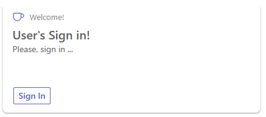
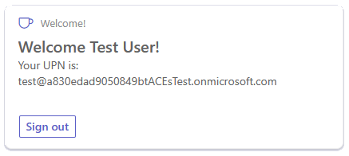

# Bot-Powered-ACE Welcome User with Microsoft Entra ID Single Sign-on

This sample shows how to create a Bot Powered Adaptive Card Extension (ACE) for Viva Connection Dashboard to authenticate the current user and to retrieve the user name.
User's authentication relies on Microsoft Entra ID and is configured to have automatic Single Sign-on of the user.

Here you can see CardView of the ACE to sign-in the current user:



Here you can see the CardView that welcomes the authenticated user:




## Used Bot Framework Version

This bot has been created using [Bot Framework v.4.22.9 or higher](https://dev.botframework.com).

## Applies to

- [Microsoft SharePoint Online](https://www.microsoft.com/en-us/microsoft-365/sharepoint/collaboration)
- [Microsoft Viva Connections](https://learn.microsoft.com/en-us/viva/connections/viva-connections-overview)

> Get your own free development tenant by subscribing to [Microsoft 365 developer program](http://aka.ms/o365devprogram)

## Solution

| Solution    | Author(s)                                               |
| ----------- | ------------------------------------------------------- |
| WelcomeUserBotPoweredAce | Paolo Pialorsi Paolo Pialorsi - [PiaSys.com](https://www.piasys.com/) - [@PaoloPia](https://twitter.com/PaoloPia) |

## Version history

| Version | Date             | Comments        |
| ------- | ---------------- | --------------- |
| 1.0     | November 09, 2024   | Initial release |

## Disclaimer

**THIS CODE IS PROVIDED _AS IS_ WITHOUT WARRANTY OF ANY KIND, EITHER EXPRESS OR IMPLIED, INCLUDING ANY IMPLIED WARRANTIES OF FITNESS FOR A PARTICULAR PURPOSE, MERCHANTABILITY, OR NON-INFRINGEMENT.**

---

## Minimal Path to Awesome

### Prerequisites

- [.NET SDK](https://dotnet.microsoft.com/download) version 6.0

  ```bash
  # determine dotnet version
  dotnet --version
  ```

### To try this sample

- In a terminal, navigate to `BotPowered_BasicAce_CollectFeedback`

    ```bash
    # change into project folder
    cd BotPowered_BasicAce_CollectFeedback
    ```

- Run the bot from a terminal or from Visual Studio, choose option A or B.

  A) From a terminal

  ```bash
  # run the bot
  dotnet run
  ```

  B) Or from Visual Studio

  - Launch Visual Studio
  - File -> Open -> Project/Solution
  - Navigate to `BotPowered-BasicAce-CollectFeedback` folder
  - Select `BotPowered-BasicAce-CollectFeedback.csproj` file
  - Press `F5` to run the project

### Deploy the bot to Azure

To learn more about deploying a bot to Azure, see [Deploy your bot to Azure](https://aka.ms/azuredeployment) for a complete list of deployment instructions.

### Further reading

- [Bot Framework Documentation](https://docs.botframework.com)
- [Bot Basics](https://docs.microsoft.com/azure/bot-service/bot-builder-basics?view=azure-bot-service-4.0)
- [Activity processing](https://docs.microsoft.com/en-us/azure/bot-service/bot-builder-concept-activity-processing?view=azure-bot-service-4.0)
- [Azure Bot Service Introduction](https://docs.microsoft.com/azure/bot-service/bot-service-overview-introduction?view=azure-bot-service-4.0)
- [Azure Bot Service Documentation](https://docs.microsoft.com/azure/bot-service/?view=azure-bot-service-4.0)
- [.NET Core CLI tools](https://docs.microsoft.com/en-us/dotnet/core/tools/?tabs=netcore2x)
- [Azure CLI](https://docs.microsoft.com/cli/azure/?view=azure-cli-latest)
- [Azure Portal](https://portal.azure.com)
- [Language Understanding using LUIS](https://docs.microsoft.com/en-us/azure/cognitive-services/luis/)
- [Channels and Bot Connector Service](https://docs.microsoft.com/en-us/azure/bot-service/bot-concepts?view=azure-bot-service-4.0)